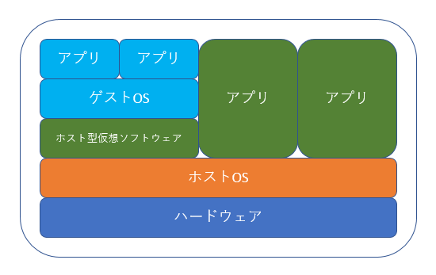

# タスク管理ツールを作る

# 〜仕様〜
* ユーザーが、タスクを登録できる
* ユーザーが、タスクをかんばんで管理できる
* ユーザーが、かんばんのレーンを変更できる

# 〜開発基礎〜

## 1、web開発基礎

### コンピュータとは

### ハードウェアとは

### ソフトウェアとは

### osとは
コンピューターを動かすためのソフトウェアのこと。

### クライアントとは

### サーバとは

### Gitとは

### GitHubとは

### Git-flowとは

### GitHub-flowとは

### Git-flowとGitHub-flowの違い

### Git コマンドリファレンス
* リポジトリを作成  
`git init`  

* インデックスに追加(Git管理の対象にあげる)
`git add <ディレクトリ名やファイル名>`
(例) `git add test`、`git add test.md`  

* コミットする
`git commit -m <"コメント">`
(例) `git commit -m "テストです"`  

* addとcommitを同時に行う
`git commit -a <ディレクトリ名やファイル名>`
(例) `git commit -a test`、`git commit -a test.md`   

* リモートリポジトリの追加
`git remote add origin <追加したいリポジトリ>`
(例) `git remote add origin https://github.com/○○○/×××.git`  

* リモートリポジトリの削除
`git remote rm origin`  

* プッシュする
`git push -u origin master`
(2回目以降は `git push` で可能)

* ブランチを作成
`git branch <ブランチ名>`
(例) `git branch new-branch`

* ブランチの一覧を表示(＊が付いているのが現在のブランチ)
`git branch`

## 2、開発環境を整える
Docker + Ruby + Rails + Vue.js + MySQLで開発環境を整える。  
「Dockerfile」と「Docker-compose.yml」を作成して「Rails環境のコンテナ」と「MySQL環境のコンテナ」の２つをビルドできるようにする。  
また、Gitでソースコード等の変更履歴を管理できるようにし、GitHubで保存、公開できるようにする。

### Dockerとは
Linuxのコンテナ技術を使った、コンテナ仮想化ツール。アプリ操作をコンテナ毎に分けて実行したり、別のOS上にコンテナを移しても動作するよう働く。

### Linuxとは
OSの一種でオープンソースのOS。  
リーナスという天才のアイディアと無数のエンジニアのボランティア精神がいつの間にか世界に広がっている。ここ15年ほどで、様々な分野で一気に広がりを見せ、分野によっては主力OSがLinuxになっているところも増えてきている。

### 仮想化とは
1台のPCで複数のOSを同時に動かすことができる技術のこと。
仮想化にはいくつか種類がある。

### 仮想化の種類

### サーバの仮想化の種類
**1、ホスト型（VMware Player、Oracle VM VirtualBoxなど）**  
ユーザー向けの仮想化。   
仮想化をアプリケーションとして利用するタイプの事。  
専用のソフトウェアの上で別のOSを動かすもの。  
既存のOS上で別のOSを動かす。  
Linuxの専用端末が用意できない時や、別のOSを動かしたい時などに利用する。

**2、ハイパーバイザ型（VMware ESXi、Windows Hyper-V、Xen、KVMなど）**  
サーバ向けの仮想化。  
OSそのものに仮想化システムを組み込む。  
仕組みはホスト型と同じようなもの。  
PCの大元のOSにハイパーバイザー専用のOSを入れたり、専用のパッケージを導入する事で、そのOSをの上で仮想マシンを作成できるようする。

**3、コンテナ型（Docker）**  
コンテナ型仮想化。  
軽量さが売り。  
ホスト型やハイパーバイザー型と違い、ホストのカーネルを直接使用するため、オーバーヘッドが小さくなる。

### サーバの仮想化のそれぞれのメリット
||メリット|デメリット|
|:--|:--|:--|
|ホスト型|a|a|
|ハイパーバイザー型|a|a|
|コンテナ型|a|a|

* 使用したツール
 * X-code
 * iTeam2
 * Atom
 * Git
 * Github
 * Docker
 * Homebrew

**1、Ruby(Rails)環境を構築する**
* 1-1、Rubyのイメージをダウンロードする  
`$ docker pull ruby`

* 1-2、Railsアプリケーション用のディレクトリを作成  
`$ mkdir ~/works/app_name`  
`$ cd ~/works/app_name`

* 1-3、

##### 2、Rails環境にVue.jsを導入
##### 3、MySQL環境を構築する
* 3-1、MySQLのイメージをダウンロードする  
`$ docker pull mysql`
##### 4、Dockerfileを作製
##### 5、docker-compose.ymlを作製

###### □　Dockerとは
> a

###### →　仮想化とは
*
*

###### →　Dockerコマンド集
*
*

###### □　Dockerfileとは
> a

###### →　用語説明
* イメージを指定  
`FROM <イメージ>`  

* 生成するイメージの Author （作者）フィールドを指定します。  
`MAINTAINER <名前>`  

###### □　Dokcer-compose.ymlとは
> a

###### →　用語説明
*
*

###### □　仮想化とは
> a

###### →　種類
*
*

###### □　Linuxとは
> a

###### →　Linuxコマンド集
*
*

###### □　Gitとは
> a

###### →　Gitコマンド集
* リポジトリを作成
`git init`  

* インデックスに追加(Git管理の対象にあげる)
`git add <ディレクトリ名やファイル名>`
(例) `git add test`、`git add test.md`  

* コミットする
`git commit -m <"コメント">`
(例) `git commit -m "テストです"`  

* addとcommitを同時に行う
`git commit -a <ディレクトリ名やファイル名>`
(例) `git commit -a test`、`git commit -a test.md`   

* リモートリポジトリの追加
`git remote add origin <追加したいリポジトリ>`
(例) `git remote add origin https://github.com/○○○/×××.git`  

* リモートリポジトリの削除
`git remote rm origin`  

* プッシュする
`git push -u origin master`
(2回目以降は `git push` で可能)

* ブランチを作成
`git branch <ブランチ名>`
(例) `git branch new-branch`

* ブランチの一覧を表示(＊が付いているのが現在のブランチ)
`git branch`

###### □　GitHubとは
> a

###### □　Git-flowとは
> a

###### □　GitHub-flowとは
> a

###### □　Git-flowとGitHub-flowの違い
> a

## 3、モデリング
* [UMLモデリングの本質](https://www.amazon.co.jp/UML%E3%83%A2%E3%83%87%E3%83%AA%E3%83%B3%E3%82%B0%E3%81%AE%E6%9C%AC%E8%B3%AA-%E7%AC%AC2%E7%89%88-%E5%85%90%E7%8E%89-%E5%85%AC%E4%BF%A1/dp/4822284646)
* [テスト駆動開発](https://www.amazon.co.jp/%E3%83%86%E3%82%B9%E3%83%88%E9%A7%86%E5%8B%95%E9%96%8B%E7%99%BA-Kent-Beck/dp/4274217884/ref=pd_sim_14_6?_encoding=UTF8&pd_rd_i=4274217884&pd_rd_r=a9cf49c3-af57-11e8-916c-9bdc4a2680a9&pd_rd_w=HFtF7&pd_rd_wg=oRIeE&pf_rd_i=desktop-dp-sims&pf_rd_m=AN1VRQENFRJN5&pf_rd_p=bfa000a0-bc74-4c24-9ec8-d3ffaab3c0cd&pf_rd_r=DSMVCK1W1SC6GGGDS223&pf_rd_s=desktop-dp-sims&pf_rd_t=40701&psc=1&refRID=DSMVCK1W1SC6GGGDS223)
→記事を2,3個読んでなんとなく理解するので良い
* 7月の勉強会資料参照
* タスク管理ツールのモデリングを実施

# 〜バックエンド＝Rails〜

# 〜フロントエンド＝Vue.js〜

# 〜フロントとバックの繋ぎ方＝GraphQL〜
